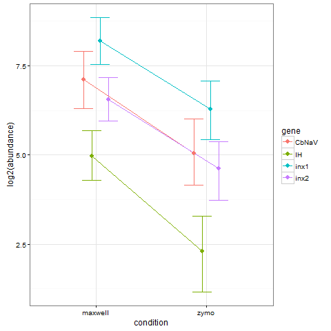

# 2016 Integrative STG Module
## Neural Systems and Behavior

# Overview
This repo contains reasearch conducting as part of the [Neural Systems and Behavior Course at MBL](http://www.mbl.edu/nsb/). The overall objective of the [Integrative Stomagtogastric Ganlion (STG) Module](http://www.mbl.edu/nsb/about/stg-integrative-molecular/) is to equip students with comprehensive understanding of the relationships between molecular activity in the nervous system and complex behavior. Knowledge and technical skills gained in this module will be widely applicable to research in other model and non-model organisms allowing students to ask questions on multiple levels of biological organization.

# Reporducible qPCR Workflow
A major goal of this research-driven educational course is to equip students with tools to be reproducible. The goal is for all data clearning, manipulation, and analysis to take place in the R enviornment so that everythign can be reproduced. 

The 'ReproducibleExample' directory does just that. It takes raw data from a qPCR machine, reorganizes it for use with the MCMC.qpcr R package, and plots the data. 

Here's a pretty plot from the reproducible workflow.
 

# Studnet Projects
As I said, this is a discovery driven course. Four students will be conducting their own reserach, and that scripts, data, and results will be stored here as well. 

# MCMC.qpcr Resources
For an in depth tutorial, check out [the MCMC.qpcr tutorial](http://www.bio.utexas.edu/research/matz_lab/matzlab/Methods.html) on the Matz lab website. Aso, be sure to [read the paper](http://journals.plos.org/plosone/article?id=10.1371/journal.pone.0071448)!

