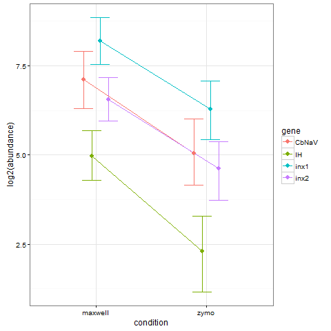

# STG Molecular Biology

## some problems
Okay, so this isn't a perfect repo. This is a hodgepod of data from the summer of 2015 when some students were doing qPCR data.
I'm not sure where their standard curve data are, so I just made up some cq data for the gene efficiencies, based on the data from Misha's tutorial. 

## So what's the point?!?
The whole reason I put this up on github is because I've perfected the data import and wrangling part of this process! Before, it took a lot of hand curation to get the data ready for MCMC.qpcr, but now we're all good.

## The good bits
- `/bin/mcmc.qpcr.stg.rmh.R` This is the script that is reproducible!
- `/data_xls` This is the directory with all the data exported from the machine. I know, why am I importing .xlxs files? Because that's what the machine spits out. :(
- `/sample_info` This is the directory with the sample info. I could have put this with the qpcr export files, but it seemed like a good idea to keep them separate

## Output
Here's a pretty plot from the data
 
